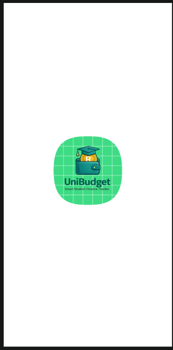
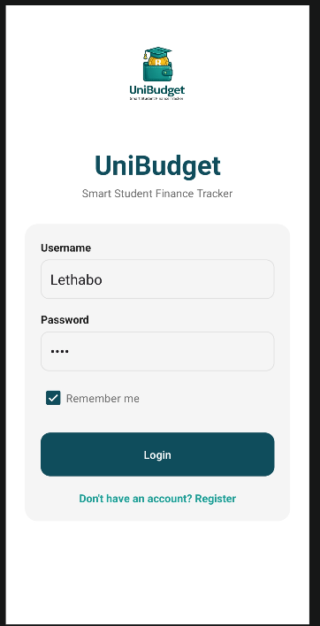
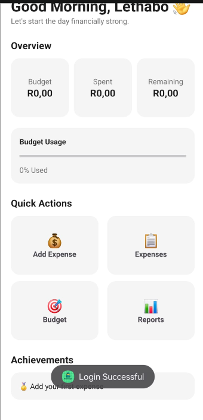
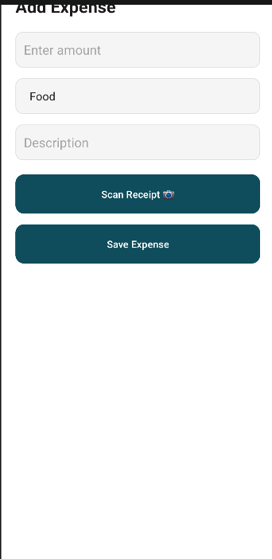
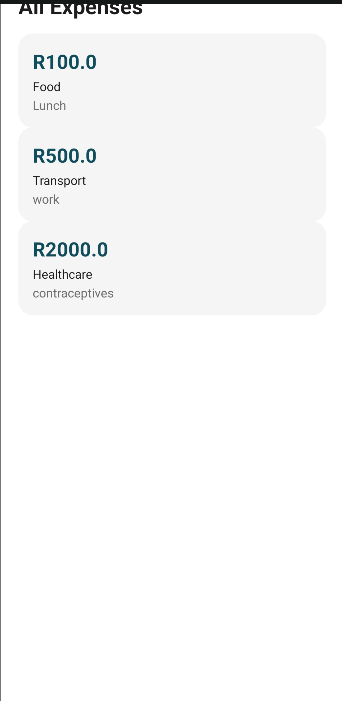
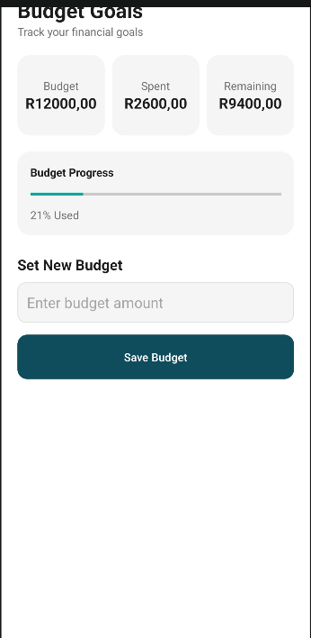
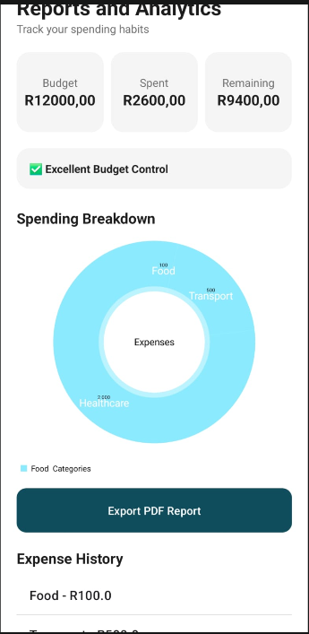
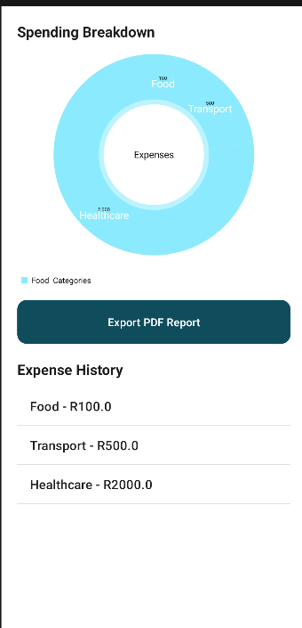
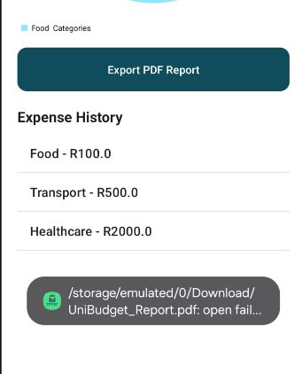
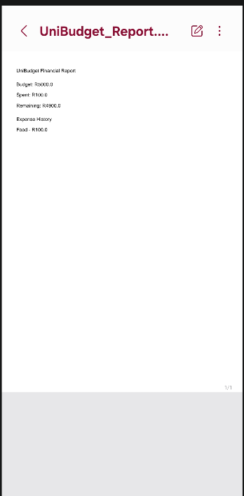

**OPSC6311 – UniBudget**
Smart Student Finance Tracker

UniBudget is an Android budgeting and expense-tracking application developed using Kotlin and Room Database. The application is designed specifically for students 
who need an easy way to manage their finances, monitor spending habits, set budgets, and generate financial reports.

The goal of the application is to help students become financially responsible by providing tools to track expenses, monitor budget usage, and analyse spending patterns.

**Project Overview**

Managing finances can be challenging for students due to limited income and increasing living expenses. UniBudget addresses this challenge by providing a simple and
user-friendly platform where users can:

Create and manage budgets
Record daily expenses
Categorise spending
Track budget usage
View financial reports
Generate PDF reports
Scan receipts using OCR technology

The application was developed as part of the OPSC6311 module and demonstrates mobile application development concepts, database management, user interface design, 
and software version control.

**Purpose of the Application**

The purpose of UniBudget is to assist students in:

Tracking their daily expenses
Managing personal budgets effectively
Identifying spending habits
Preventing overspending
Improving financial planning
Generating financial reports for analysis

The application encourages responsible financial management through visual feedback and spending analytics.

**Features**
1. User Authentication

The application provides a login interface where users can access the budgeting system.

Functionality
Username input
Password input
Remember Me functionality
User registration support
Dashboard

The dashboard acts as the central hub of the application.

Functionality
Displays total budget
Displays total expenses
Displays remaining balance
Shows budget usage progress
Provides quick navigation to all modules
Expense Management

Users can record and manage their expenses.

Functionality
Add expense amount
Select expense category
Enter expense description
Save expenses to database
View expense history
Categories
Food
Transport
Education
Housing
Utilities
Healthcare
Entertainment
Shopping
Personal Care
Other
Receipt Scanning (OCR)

The application integrates Google ML Kit text recognition to scan receipts and automatically extract amounts.

Functionality
Opens device camera
Captures receipt image
Detects text
Extracts numerical values
Automatically populates expense amount field

This feature reduces manual data entry and improves convenience for users.

Budget Management

Users can create and monitor financial goals.

Functionality
Set budget amount
View amount spent
View remaining balance
Monitor budget progress
Receive visual spending feedback
Reports and Analytics

The reporting module provides insights into spending behaviour.

Functionality
Spending summaries
Category breakdowns
Expense history
Budget analysis
PDF export
PDF Report Generation

The application generates financial reports in PDF format.

Included Information
Budget amount
Total expenses
Remaining balance
Expense history

This feature allows users to store or share financial records.

Technologies Used
Technology	Purpose
Kotlin	Android Application Development
Android Studio	Development Environment
Room Database	Local Data Storage
RecyclerView	Expense Display
Material Design	User Interface Design
Google ML Kit	Receipt OCR Scanning
MPAndroidChart	Report Visualisation
PDFDocument	PDF Generation
Git	Version Control
GitHub	Repository Hosting
Database Design

The application uses Room Database for local data storage.

Entities
User

Stores user login information.

Expense

Stores:

Expense Amount
Expense Category
Expense Description
Budget

Stores:

Budget Amount
Budget Progress
Category

Stores expense categories.

Design Considerations

Several design principles were considered during development.

Simplicity

The interface was designed to be clean and easy to navigate for students with varying levels of technical experience.

Accessibility

Large buttons and readable text were used to improve usability.

Consistency

Colours, layouts, and navigation structures remain consistent throughout the application.

Performance

Room Database was implemented to provide efficient local data storage and retrieval.

Maintainability

The application follows a modular structure that separates activities, database components, and resources.

GitHub Utilisation

GitHub was used throughout the development process for source control and project management.

Benefits of GitHub
Version control
Code backup
Project tracking
Collaboration support
Commit history management
Repository hosting

The GitHub repository contains all project files, documentation, and source code.

Repository Link:

https://github.com/Lethabomaphala/OPSC6311-UniBudget
GitHub Actions

GitHub Actions is a Continuous Integration (CI) tool provided by GitHub.

**Purpose**
GitHub Actions can be used to:
Automatically build projects
Run tests
Validate code
Improve deployment workflows
Benefits
Faster development
Automated verification
Reduced human error
Improved software quality

Although the current project primarily utilised GitHub for version control, GitHub Actions provides an opportunity for future automation and continuous integration.

1. Application Screenshots
Splash Screen

Displays the UniBudget logo while the application loads.

2. Login/Register Screen

Allows users to enter credentials and access the application.

3. Dashboard
Provides a summary of financial information.
e

4. Add Expense
Allows users to record new expenses and scan receipts.

5. View Expenses
Displays all saved expenses.

6. Budget Goals
Allows users to set and monitor spending limits.

7. Reports and Analytics
Displays spending insights and financial analytics.

8. PDF Report
Generated financial report exported from the application.

**Challenges Encountered**
Several challenges were experienced during development:
Database Integration
Configuring Room Database and ensuring data persistence required careful implementation.
OCR Receipt Scanning
Receipt scanning occasionally detects incorrect numerical values due to varying receipt layouts and image quality.

Navigation

Ensuring seamless navigation between screens required extensive testing.

PDF Export

Generating and exporting PDF reports required additional file handling permissions and testing.

**Future Improvements**
Future versions of UniBudget may include:
Cloud database integration
User accounts and authentication
Multiple budget profiles
Spending notifications
Dark mode support
Advanced analytics
Improved OCR accuracy
Receipt image storage
Data backup and synchronisation

Name	Role
Member 1 - Lethabo Mokaba 	Developer
Member 2 - Dimpho Tshabalala	Developer
Member 3 - Leago Motsepe	Developer

**Conclusion**
UniBudget successfully demonstrates the implementation of a student budgeting and expense tracking application using Android Studio, Kotlin, and Room Database. T
he application provides users with practical tools for managing finances, monitoring spending habits, generating reports, and maintaining financial discipline. 
Through the use of modern Android development practices and GitHub version control, the project showcases both technical and software engineering principles required 
for mobile application development.